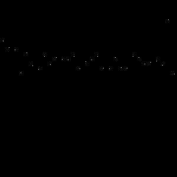

# When the Stars Align.. Writeup

This challange only supply you with a file called stars.png and the title "When the Stars Align"

# Keep it simple stupid

We quickly went down the rabbit hole on this one, thinking that we had to use either the [ method of least squares](https://en.wikipedia.org/wiki/Least_squares) or that a  group of stars corresponded to constelations. We quickly realised that this was probably not the correct method since even if we were to use the method of least squares and/or mapping the stars to constelations it would not give us any new information that we could move forward with.

Luckily the solution turned out to be much easier than this.

# Solution

All the "stars" turned out to be 1 pixel. After looking at the x and y position of the stars we had the following information:
| X | Y |
| - | - |
|	5	|	69	|
|	15	|	80	|
|	25	|	84	|
|	35	|	123	|
|	45	|	89	|
|	55	|	111	|
|	65	|	117	|
|	75	|	95	|
|	85	|	109	|
|	95	|	97	|
|	105	|	100	|
|	115	|	101	|
|	125	|	95	|
|	135	|	116	|
|	145	|	104	|
|	155	|	101	|
|	165	|	95	|
|	175	|	115	|
|	185	|	116	|
|	195	|	97	|
|	205	|	114	|
|	215	|	115	|
|	225	|	95	|
|	235	|	97	|
|	245	|	108	|
|	255	|	105	|
|	265	|	103	|
|	275	|	110	|
|	286	|	33	|
|	295	|	125	|

You can see that the x values are increasing steadily by 10 for each new pixel, however the Y values are fluctuating and appearing more "random". Running the Y values through an ASCII to Text converter spits out the flag **`EPT{You_made_the_stars_align!}`** 